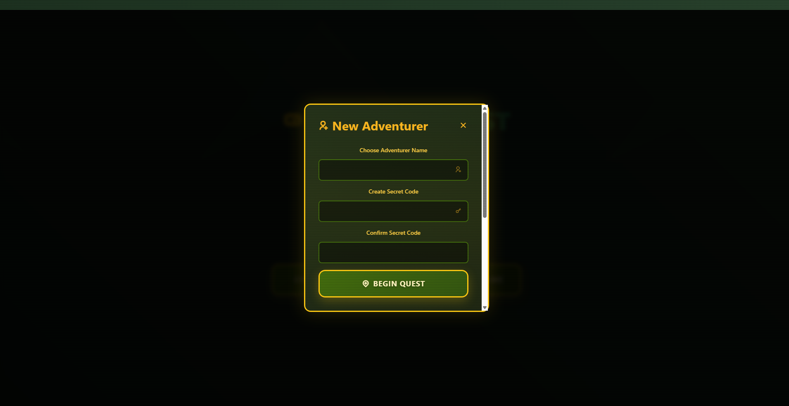
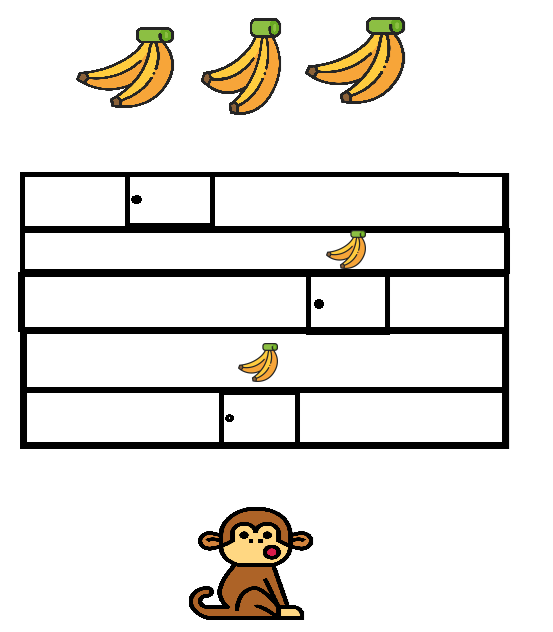
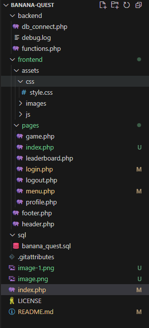

# Banana Quest Project Structure

## Student Details
- **Full Name**: Udayasooriyan Prabudeva  
- **Email**: prabudeva.udayasooriyan@study.beds.ac.uk  
- **University**: University of Bedfordshire  
- **Registration Number**: 2431980  
- **Affiliated Institution**: SLIIT City Uni, Sri Lanka  

## Project Overview
"Banana Quest" is an interactive web-based puzzle game developed using **HTML**, **Tailwind CSS**, **CSS**, **JavaScript**, **PHP**, **MySQL**, and **AJAX** for dynamic front-end and back-end integration. Players guide a monkey through a grid of locked doors to reach a pile of bananas. Starting at Level 1 with one row and one door, players solve puzzles fetched from the **Banana API** (https://marcconrad.com/uob/banana/api.php) to unlock doors. Each level increases in complexity by adding two more rows—Level 2 has 3 doors, Level 3 has 5 doors, and so forth. Successfully solving all puzzles in a level advances the player, with the grid expanding accordingly. AJAX handles login, signup, puzzle retrieval, and game state updates, ensuring a smooth user experience. This project combines logic, design, and external API integration for a fun and challenging adventure!

## Banana API Usage
Per the assignment requirements, the **Banana API** (https://marcconrad.com/uob/banana/api.php?out=json) is utilized to source puzzles for the game. Integrated via PHP in the `puzzle_ajax.php` script, the API delivers JSON-formatted questions and solutions. The solution is stored in a PHP session, and user answers, submitted through AJAX POST requests, are validated against it. This external API enriches the gameplay with diverse puzzles, fulfilling the assignment’s objective of incorporating an external puzzle provider.

## Folder Structure
```
banana-quest/
├── backend/                     # Backend logic and functionality (PHP & MySQL)
│   ├── clear_user_history.php   # Clears user history data
│   ├── db_connect.php           # Database connection script
│   ├── fetch_user_history.php   # Fetches user history data
│   ├── fetch_users_data.php     # Fetches all users' data
│   ├── functions.php            # Core backend functions
│   ├── login.php                # Handles user login via AJAX
│   ├── logout.php               # Handles user logout
│   ├── banana_api.php          # Handles Banana API puzzle requests via AJAX
│   ├── save_game_data.php       # Saves game progress
│   ├── signup.php               # Handles user registration via AJAX
│   └── update_password.php      # Updates user passwords
├── frontend/                    # Frontend components (HTML, Tailwind CSS, CSS, JS)
│   ├── assets/                  # Static assets
│   │   ├── css/                 # Stylesheets
│   │   │   └── jungle-bg.css    # Jungle background styling
│   │   └── images/              # Image assets
│   ├── js/                      # JavaScript files for AJAX calls and game logic
│   ├── footer.php               # Footer component
│   ├── game.php                 # Game interface
│   ├── header.php               # Header component
│   ├── index.php                # Homepage
│   ├── leaderboard.php          # Leaderboard page
│   ├── menu.php                 # Main menu page
│   ├── profile.php              # User profile page
│   ├── result.php               # Game result page
│   └── test.php                 # Test page for debugging
├── sql/                         # Database resources
│   └── banana_quest.sql         # SQL script for database setup
└── LICENSE                      # License file
└── Readme                       # Readme file
```

## Database Resources
- **Database Name**: `banana_quest`
- **Tables**:
    - `users`: Stores user information (e.g., username, password, email).
    - `user_history`: Tracks user actions and scores.

## Additional Materials
1. **Video Presentation**: A video of maximum 10 minutes length.
2. **Project Management**: [Notion Workspace](https://www.notion.so/BANANA-QUEST-1c0460e45a4880ddb4f1d4552e9bb169?pvs=21)
3. **Design**:
    - [Figma Design](https://www.figma.com/design/KMCssR7FdJxr9MobG9yvIe/Untitled?node-id=0-1&t=6b0Uuu5tWlb8oNYR-1)
    - [OneDrive Design Assets](https://1drv.ms/f/c/48351f8739b0c623/EpQFQjuvYlxHokqRLMC8hSUBeecliv9bdz0PBsD9e3JeoQ?e=N2daRO)
4. **Source Code**:
    - [GitHub Repository](https://github.com/prabud0401/BANANA-QUEST.git)
    - [OneDrive Source Code](https://1drv.ms/f/c/48351f8739b0c623/Eg7NkyUWEpVGszeG9u2sW4kBFTXQ1cdbsrxgxWkccX_BPw?e=ruY7cT)
5. **Evidence of Presentation**: Proof of project presentation to the tutor in Week 8.

## Images
Below are the images used in the project:
1. 
2. 
3. 